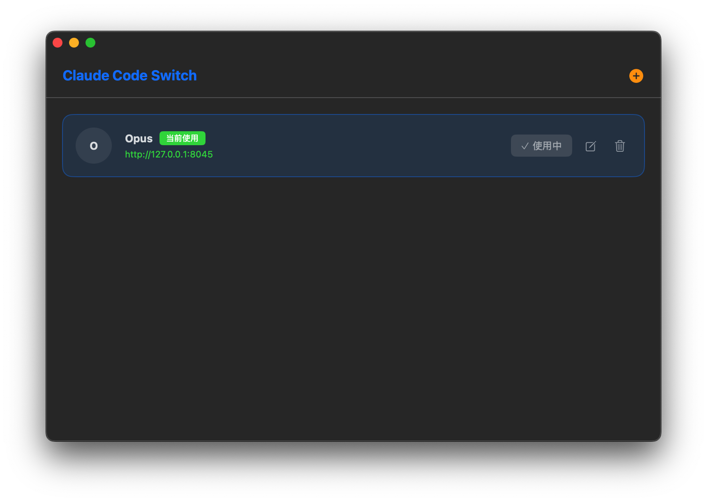

# Claude Code Switch

A macOS utility to quickly switch between different API environment configurations for Claude Code CLI.



## Features

- **Manage Multiple Presets** - Save and organize different env configurations for `~/.claude/settings.json`
- **One-Click Switch** - Instantly activate any preset to switch API environments
- **JSON Editor** - Edit env configurations directly with a built-in JSON text editor
- **Auto-Load Default** - Automatically loads your current env as the default preset on first launch
- **Native macOS App** - Built with SwiftUI for a seamless macOS experience

## Installation

1. Download `ClaudeCodeSwitch.dmg` from the [Releases](https://github.com/zwmjohn-cool/Claude-Code-Switch/releases) page
2. Open the DMG and drag the app to your Applications folder
3. Launch Claude Code Switch from Applications

## Usage

1. **Add a Preset** - Click the `+` button to create a new env configuration
2. **Edit Preset** - Enter a name and customize the JSON env settings
3. **Activate** - Click "启用" (Enable) to apply a preset to your Claude Code settings
4. **Current Status** - The active preset shows "使用中" (In Use) indicator

## Configuration

The app manages the `env` section in `~/.claude/settings.json`. Example configuration:

```json
{
  "ANTHROPIC_API_KEY": "your-api-key",
  "ANTHROPIC_BASE_URL": "https://api.anthropic.com",
  "ANTHROPIC_MODEL": "claude-sonnet-4-20250514"
}
```

Presets are stored in `~/.claude/env_presets.json`.

## Requirements

- macOS 14.0 or later

## License

MIT License
